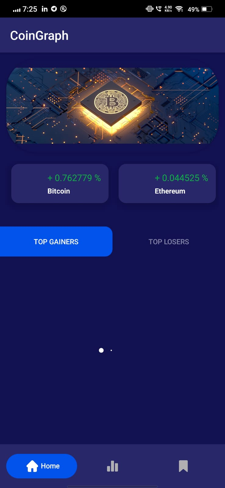
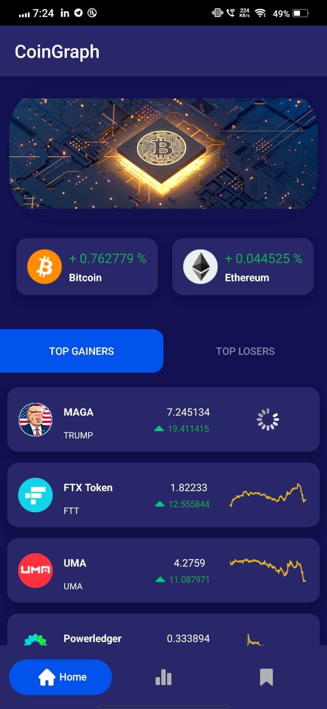
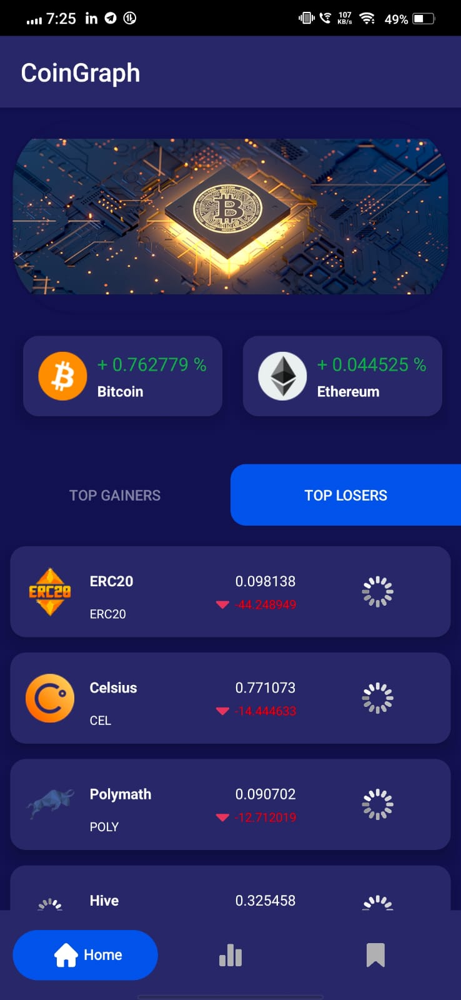
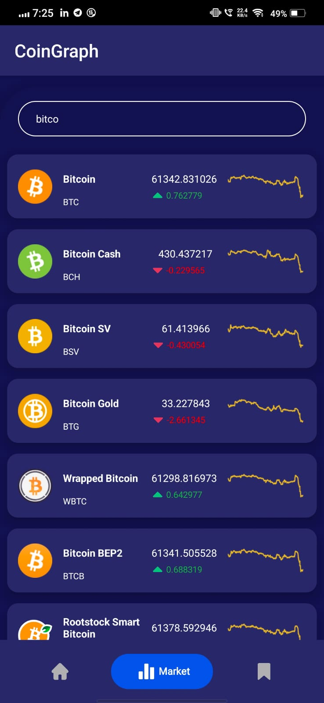
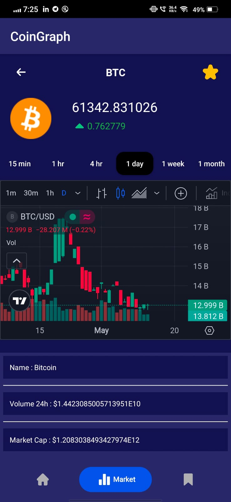
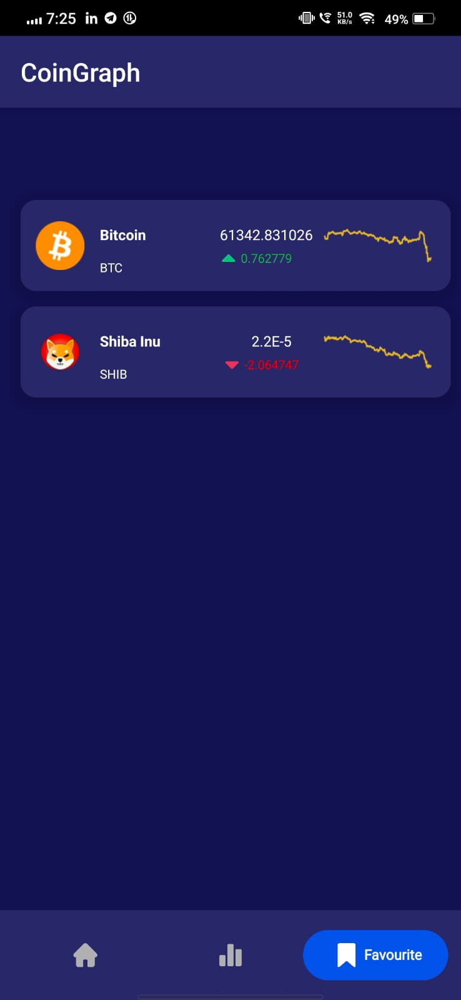

# CoinGraph - Cryptocurrency Monitoring Application

Coingraph: Your go-to Android app for monitoring cryptocurrency trends in real-time. Stay updated on
the latest prices, market fluctuations, and trends with cryptocurrency trading chart and
user-friendly interface.

## Features

- Utilizes retrofit api to fetch data from web and display it in the ui
- Displays market top gainers and top lossers
- Displays detailed view of every coin with their graphs
- Uses 3rd party libraries like SmoothBottomBar for bottom navigation views, Spinkit view to show
  graphics while loading the data and glide to load the image from the web
- Uses shared preferences to store the data of saved currencies ## Run the application

### Points to remember :

- Android studio should be installed in the system  (prefer latest version )
- Git should be installed in the system

```bash
  mkdir Coingraph - application

  cd Coingraph

  git clone https://github.com/VinayakGardi/CoinGraph---Cryptocurrency-Monitoring-application.git

```

- Run android studio
- run the project in emulator or any physical device

## Screenshots

<!-- Screenshots -->

<div style="display: flex; justify-content: space-between;">

  
   
  
  
  
  
  


</div>

## Technology used

- Kotlin - Programming language for Android app development.
- Retrofit API - Retrofit is a popular Android library that simplifies HTTP requests by providing a
  type-safe way to define and consume RESTful APIs. It uses annotations to map API endpoints and
  structures responses with converter factories for easy integration with Gson or other
  serialization libraries.
- RecyclerView - Flexible view for displaying lists or grids.

